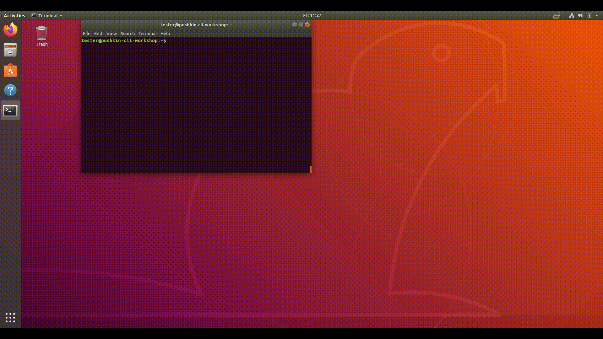
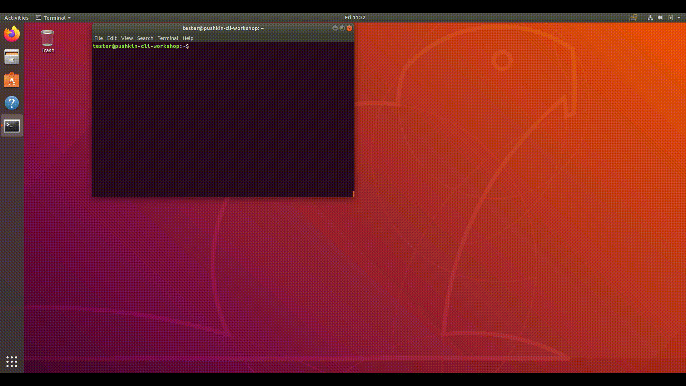

# Ubuntu Linux

These instructions were created using Ubuntu 18.04 and the apt package manager but should generalize to other Linux distributions and package managers.

## Skip to section

* [Install curl](ubuntu-install.md#install-curl)
* [Install Node.js](ubuntu-install.md#install-nodejs)
* [Install and configure Yarn](ubuntu-install.md#install-and-configure-yarn)
* [Install pushkin-cli](ubuntu-install.md#install-pushkin-cli)
* [Install and configure Docker Engine](ubuntu-install.md#install-and-configure-docker-engine)
* [Install and configure Docker Compose](ubuntu-install.md#install-and-configure-docker-compose)
* [Next steps](ubuntu-install.md#next-steps)

### Install curl

First, ensure that you have curl installed, as this will be necessary to download Node. If it is not installed, it can be installed using the following commands:

```bash
$ sudo apt update
$ sudo apt install curl
```
 


### Install Node.js

To install the latest version of Node.js , follow [these instructions at NodeSource](https://github.com/nodesource/distributions/blob/master/README.md#installation-instructions). The instructions are copied below for convenience, but it is best to follow the link in case their instructions change in the future.

```bash
$ curl -sL https://deb.nodesource.com/setup_14.x | sudo -E bash -
$ sudo apt install -y nodejs
```


### Install and configure Yarn

You will next want to install the Yarn package manager. Official instructions \(copied below for convenience\) are available [here](https://classic.yarnpkg.com/en/docs/install/#debian-stable).

```bash
$ curl -sS https://dl.yarnpkg.com/debian/pubkey.gpg | sudo apt-key add -
$ echo "deb https://dl.yarnpkg.com/debian/ stable main" | sudo tee /etc/apt/sources.list.d/yarn.list
$ sudo apt update && sudo apt install yarn
```


To allow Yarn to install pushkin-cli globally, run the following steps, based on [this StackExchange solution](https://stackoverflow.com/a/53879534).

Run the following:

```bash
$ yarn config set prefix ~/.yarn
$ echo 'export PATH="$PATH:`yarn global bin`"' >> ~/.bashrc
$ source ~/.bashrc
```


### Install pushkin-cli

Next, install the pushkin-cli package globally.

```bash
$ yarn global add pushkin-cli
```


Confirm that pushkin-cli is installed by running:

```bash
$ pushkin --help
```

You should get a list of commands with some documentation for each.


### Install and configure Docker Engine

Next, install Docker Engine [using these instructions](https://docs.docker.com/engine/install/ubuntu/) \(copied below for convenience\).

```bash
$ sudo apt update
$ sudo apt install apt-transport-https ca-certificates curl gnupg-agent software-properties-common
$ curl -fsSL https://download.docker.com/linux/ubuntu/gpg | sudo apt-key add -
```


Verify the fingerprint of the key by running this command:

```bash
$ sudo apt-key fingerprint 0EBFCD88
```

Your output should look like this:

```bash
pub   rsa4096 2017-02-22 [SCEA]
      9DC8 5822 9FC7 DD38 854A  E2D8 8D81 803C 0EBF CD88
uid           [ unknown] Docker Release (CE deb) <docker@docker.com>
sub   rsa4096 2017-02-22 [S]
```



Next, add the repository and install Docker Engine.

```bash
$ sudo add-apt-repository "deb [arch=amd64] https://download.docker.com/linux/ubuntu $(lsb_release -cs) stable"
$ sudo apt update
$ sudo apt install docker-ce docker-ce-cli containerd.io
```


Check that Docker Engine has been installed correctly by running:

```bash
$ sudo docker run hello-world
```

If Docker Engine installed correctly, this should generate some output, including:

```bash
Hello from Docker!
This message shows that your installation appears to be working correctly.
```



Next, follow [these post-installation instructions](https://docs.docker.com/engine/install/linux-postinstall/#manage-docker-as-a-non-root-user) \(copied below for convenience\) to manage Docker as a non-root user. \(The rest of the post-installation instructions can be ignored.\)

```bash
$ sudo groupadd docker
$ sudo usermod -aG docker $USER
$ newgrp docker 
$ docker run hello-world
```


### Install and configure Docker Compose

Finally, follow [these instructions](https://docs.docker.com/compose/install/#install-compose-on-linux-systems) \(copied below for convenience\) to install Docker Compose.

```bash
$ sudo curl -L "https://github.com/docker/compose/releases/download/1.26.2/docker-compose-$(uname -s)-$(uname -m)" -o /usr/local/bin/docker-compose
$ sudo chmod +x /usr/local/bin/docker-compose
$ docker-compose --version
```


### Next steps

Great! You're all done. Head over [here](../quickstart.md) to build a basic Pushkin site and experiment.
