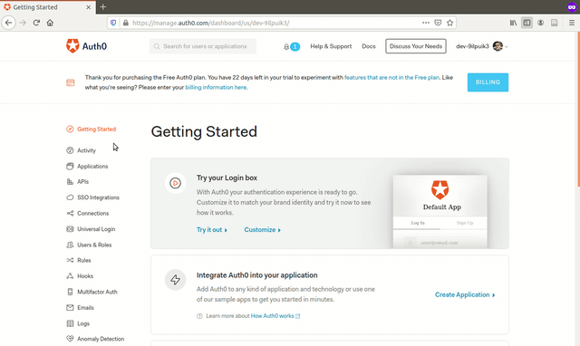
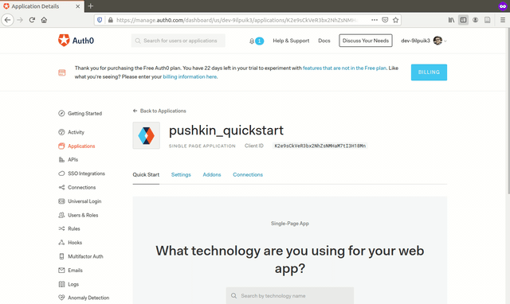
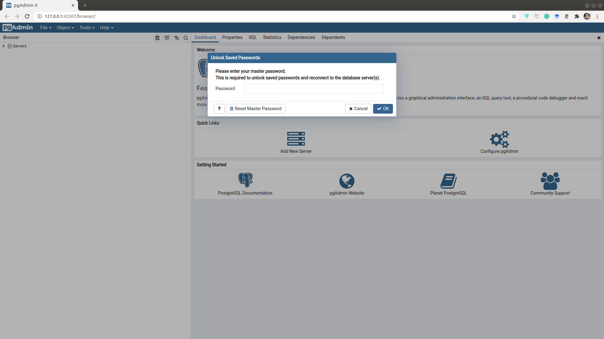
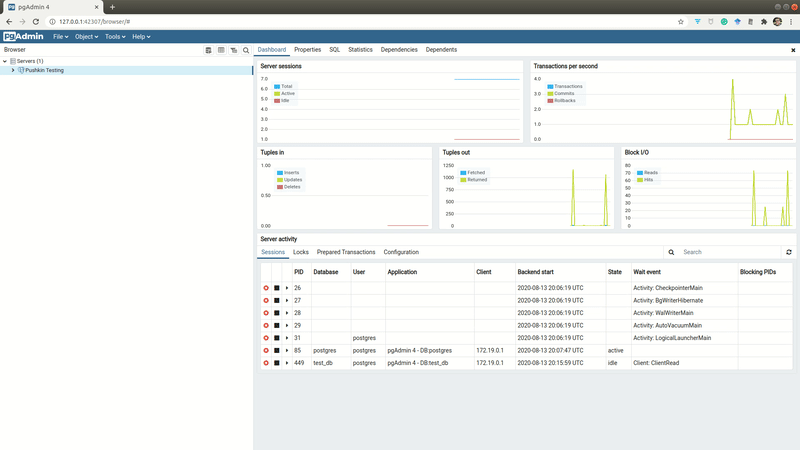
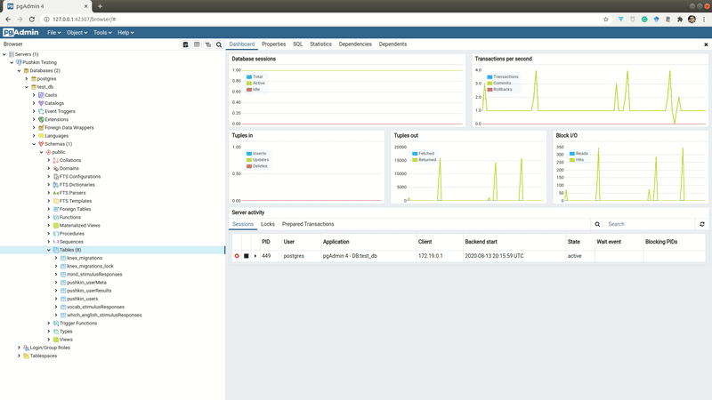

# Quickstart

## Skip to section

* [Creating a basic new Pushkin site](./#creating-basic-new-pushkin-site)
* [Updating configs](./#updating-configs)
* [Making an experiment](./#making-an-experiment)
* [Setting up logins](./#setting-up-logins)
* [Local testing](./#local-testing)
* [Updating](./#updating)
* [Viewing your database with a Postgres manager](./#viewing-your-database-with-a-postgres-manager)
* [Starting over](./#starting-over)

**If you haven't installed pushkin-cli and its dependencies, start** [**here**](../installing-pushkin-and-dependencies/) **first.**

### Creating a basic new Pushkin site

Make sure Docker is running by running the command `docker info`; if it isn't, you can run `dockerd` or `sudo dockerd` to start it.

Open a terminal window. Create an empty directory \(e.g., `pushkin_quickstart`\) and enter this directory using the following commands:

```bash
$ mkdir pushkin_quickstart
$ cd pushkin_quickstart/
```


\(For more on basic terminal commands, you can check out [this blog post](https://medium.com/@grace.m.nolan/terminal-for-beginners-e492ba10902a).\)

Install your first pushkin site the in the directory you just created:

```bash
$ pushkin install site
```

You will be asked to select a site template to use. Choose **default**, then choose the recommended version.


\(See example output for this command [here](sample_output.md#example-output-for-pushkin-install-site).\)

This sets up a skeleton website in the current folder and a development database. Once the command finishes, you should have a directory tree like this:

```text
├── experiments
├── LICENSE
├── pushkin
│   ├── api
│   ├── docker-compose.dev.yml
│   └── front-end
├── pushkin.yaml
├── README.md
└── users
    ├── config.yaml
    └── migrations
```

The files in the `pushkin` folder won’t need to be edited at all except those in the `front-end` folder.

### Updating configs

Open `pushkin.yaml` in your project root directory. It should look something like:

```yaml
# main directories relative to project root ('..')
experimentsDir: 'experiments'
coreDir: 'pushkin'
DockerHubID: ''

# databases configs experiments can use
databases:
  localtestdb:
    user: 'postgres'
    pass: 'example'
    url: 'test_db'
    name: 'test_db'
    host: 'localhost'

# basic site configuration
info:
  rootDomain: 'localhost'
  whoAmI: 'Citizen Science Website'
  hashtags: 'science, learn'
  email: 'me@mydomain.com'
  shortName: 'CSW'
addons:
  useForum: false
  useAuth: true
  authDomain: '<YOUR_AUTH0_DOMAIN>'
  authClientID: '<YOUR_AUTH0_CLIENT_ID>'    
salt: 'abc123'
fc: {
  popup: false
}
```

You can ignore most of these (or all, if you want to keep the defaults). But probably you should change:

- whoAmI: This is the name of your website that will be displayed to users
- shortName: An abbreviated name of your website
- hashtags: These are hashtags used for social media
- email: An email where notifications, etc., will be sent to.

The one you should *definitely* change is `salt`. This is used to encrypt private information. Type in any alphanumeric text here -- for instance: 

```yaml
   salt: 'personwomanmancameratv'
```

### Making an experiment

To create a new experiment from the boilerplate template Pushkin provides, run

```bash
$ pushkin install experiment
```

Choose a **basic** experiment. When prompted, name your experiment `vocab` and choose the recommended version. Repeat the process to add **basic** experiments called `mind` and `whichenglish` as well.


\(See example output for this command [here](sample_output.md#example-output-for-pushkin-install-experiment).\)

This will create a new folder in the experiments directory like this:

```text
└── vocab
    ├── api controllers
    ├── config.yaml
    ├── LICENSE
    ├── migrations
    ├── README.md
    ├── web page
    └── worker
└── mind
    ├── api controllers
    ├── config.yaml
    ├── LICENSE
    ├── migrations
    ├── README.md
    ├── web page
    └── worker
└── whichenglish
    ├── api controllers
    ├── config.yaml
    ├── LICENSE
    ├── migrations
    ├── README.md
    ├── web page
    └── worker
```

Each experiment has its own folder. Within this experiment-specific folder, there is also configuration file \(`config.yaml`\), which allows you to define a human-readable full name for the experiment \(e.g., _Which English?_ for `whichenglish`\), specify a database to use, and make other customizations.

Keeping all the files for an experiment within the same root folder is convenient for development, but not for actually deploying the website. To redistribute the experiment files to the right places, run:

```bash
$ pushkin prep
```


\(See example output for this command [here](sample_output.md#example-output-for-pushkin-prep).\)

### Setting up logins

Coming soon!

<!-- In `config.js`, located at `./pushkin/front-end/src`, set `useAuth` to `true` or `false` depending on whether you want to have a login system or not. Note that you cannot use a forum without a login system: -->

<!-- ```javascript -->
<!-- useForum: false, -->
<!-- useAuth: false, -->
<!-- ``` -->

<!-- By default, Pushkin authenticates users using [Auth0](https://auth0.com/). This provides more features and better security than could be managed otherwise. It is free for open source projects \(contact [sales@auth0.com](mailto:sales%40auth0.com)\); otherwise it can be expensive if you are hoping for a lot of users. To set up Auth0, use the following directions. \(Note that at some point, Auth0 will change up their website and these instructions may get out of date.\) -->

<!-- Go to auth0.com and create an Auth0 account. -->

<!--  -->

<!-- Go to the _Applications_ section of the Auth0 dashboard and click _Create Application_. Give your application and a name. Select _Single Page Web App_ as your application type. Click _Create_. -->

<!--  -->

<!-- 4. Choose the _Settings_ tab. In _Allowed Callback URLs_, add `http://localhost/`. In _Allowed Logout URLs_, add `http://localhost`. In _Allowed Web Origins_, also add `http://localhost`. Click the _Save Changes_ button. -->

<!--  -->

<!-- Note that these URLs are used for development. When you launch the live version of your website, you will need to add your public URLs. Repeat the instructions above, replacing [http://localhost](http://localhost) with [https://YOUR-WEBSITE](https://YOUR-WEBSITE). For instance, for gameswithwords, the URLs are `https://gameswithwords.org` and `https://gameswithwords/callback`. -->

<!-- If you are using an AWS EC2 instance, navigate to the IPv4 Public IP address of your instance instead of `http://localhost`. This can be found in the AWS EC2 console. -->

<!--  -->

<!-- On the settings page, you will see a `Domain` \(something like `gameswithwords.auth0.com`\) and a `Client ID`. Edit `pushkin/front-end/src/config.js` to match: -->

<!-- ```javascript -->
<!-- authDomain: '<YOUR_AUTH0_DOMAIN>', -->
<!-- authClientID: '<YOUR_AUTH0_CLIENT_ID>', -->
<!-- ``` -->
<!--  -->

<!-- Run `pushkin prep` again since you have made a change to your code. -->

### Local testing

Now, let’s look at your website! Make sure Docker is running by running the command `docker info`; if it is not, you can run `dockerd` or `sudo dockerd` to start it. Next, run:

```bash
$ pushkin start;
```


\(See example output for this command [here](sample_output.md#example-output-for-pushkin-start).\)

Now browse to `http://localhost` to see the stub website. 


If you are using an AWS EC2 instance, navigate to the IPv4 Public IP address of your instance instead of `http://localhost`. This can be found in the AWS EC2 console.


When you are done looking at your website, stop it by running:

```bash
$ pushkin stop;
```


If you don’t do that, the web server will keep running in Docker until you quit Docker or restart. When the command has finished running, it should output `done`.

### Updating

Every time you update code or add an experiment, you’ll need to run pushkin prep again:

```bash
$ pushkin prep
$ pushkin start
```
### Viewing your database with a Postgres manager
By default, the Pushkin creates a database called `test_db` where your data is stored. (This is explained in further detail [here](../../advanced/experiment-structure/experiment-config-files.md#database).) In order to view your database and easily see your data, you should install a Postgres Manager such as [SQLPro for Postgres](https://macpostgresclient.com/), which costs $7.99/month after the free trial ends. Free and open-source managers are also available \(e.g., [pgAdmin](https://www.pgadmin.org/download/)). Or, if you become very comfortable connecting to postgres through the command line \(not documented in this tutorial\), then you may not need a Postgres manager.

This tutorial will assume that you've downloaded and installed [pgAdmin](https://www.pgadmin.org/download/). Windows, macOS, and Ubuntu users can all download pgAdmin from their [official download page](https://www.pgadmin.org/download/). Ubuntu users can also install it from the command line using [these instructions](https://www.pgadmin.org/download/pgadmin-4-apt/).

When you start pgAdmin, it will take a moment to load and then will appear as a new tab in your web browser. When you install it the first time, it will ask you to set a master password. This can be whatever you'd like, but make sure you keep it in a secure place.



Under the *Quick Links*, click **Add New Server**. (Make sure you have run `pushkin start;` and that your site is running in `localhost` or at your IPv4 Public IP address.) Then follow these steps:

1. You can set the name of the server to anything, for example `Pushkin Testing`. 
2. Then move to the *Connection* tab and set **Host name/address** to `localhost` (or your IPv4 Public IP address). 
3. Set the password to the default password, `example`, which you can find in `pushkin.yaml`. 
4. Click **Save** and your *Pushkin Testing* server should appear in the left sidebar.


To view your data tables, navigate to the left sidebar:

1. Click to expand your *Pushkin Testing* server.
2. Select **test_db** under *Databases*. 
3. Select **Schemas**, which will also open its subitem **public**. 
4. Under **public**, choose **Tables**.

By default, you should have 5 tables: `knex_migrations`, `knex_migrations_lock`, `pushkin_userMeta`, `pushkin_userResults`, and `pushkin_users`. You should also have one table for each experiment; if you've followed this tutorial, you should also have `mind_stimulusResponses`, `vocab_stimulusResponses`, and `which_english_stimulusResponses`. 



To view a given table, right-click on it, hover over *View/Edit Data*, and click on **All Rows**, which will then appear in a new pgAdmin tab.



For more information on how to use pgAdmin, you can read their documentation [here](https://www.pgadmin.org/docs/).

### Starting over

The great thing about Docker is that it saves your work. \(Read up on Docker to see what I mean.\) The bad thing is that it saves your work. Simply editing your code locally may not change what Docker thinks the code is. If you are updating something but it’s not showing up in your website or if you are getting error messages from Docker … ideally, you should read up on Docker. However, as a fail-safe, run `pushkin kill` to delete all your Pushkin-specific code in Docker. Then just run `pushkin prep` again. This will take a while but should address any Docker-specific problems. If you really need a fresh Docker install, run `pushkin armageddon`, which will completely clean Docker.

